<p align="center"></p>

# Cloudberry

Vibecoded with Claude Opus 5.5 & Sonnet 5.5.

An unofficial client for YouTube Music, **not affiliated with Google**. A fast, native
desktop player written in Rust with [Slint](https://slint.dev), styled as a classic desktop music
player: sidebar, toolbar with a live spectrum analyzer, playlist tabs and a sortable table.
Licensed GPL-3.0-or-later.

## Install
Everything below comes from the [latest release](https://github.com/nishiki001/cloudberry/releases/latest)
(the file names never change, so these links always work). Cloudberry needs nothing else: it fetches
yt-dlp and deno itself on first start.

| System | How |
|---|---|
| **Linux, any distro** | [AppImage](https://github.com/nishiki001/cloudberry/releases/latest/download/Cloudberry-x86_64.AppImage) (aarch64: `Cloudberry-aarch64.AppImage`): `chmod +x Cloudberry-*.AppImage && ./Cloudberry-*.AppImage` |
| Linux, Flatpak bundle | [Cloudberry-x86_64.flatpak](https://github.com/nishiki001/cloudberry/releases/latest/download/Cloudberry-x86_64.flatpak): `flatpak install --user Cloudberry-x86_64.flatpak` |
| Debian / Ubuntu | [cloudberry_amd64.deb](https://github.com/nishiki001/cloudberry/releases/latest/download/cloudberry_amd64.deb): `sudo apt install ./cloudberry_amd64.deb` (`_arm64.deb` for ARM) |
| Fedora / openSUSE | [cloudberry.x86_64.rpm](https://github.com/nishiki001/cloudberry/releases/latest/download/cloudberry.x86_64.rpm): `sudo dnf install ./cloudberry.x86_64.rpm` (`.aarch64.rpm` for ARM) |
| Linux tarball | [cloudberry-linux-x86_64.tar.gz](https://github.com/nishiki001/cloudberry/releases/latest/download/cloudberry-linux-x86_64.tar.gz) |
| **macOS** | [Cloudberry-macos-universal.dmg](https://github.com/nishiki001/cloudberry/releases/latest/download/Cloudberry-macos-universal.dmg), drag to Applications. Until the app is notarized, open it the first time with right-click → Open |
| **Windows** | [Cloudberry-windows-x86_64-setup.exe](https://github.com/nishiki001/cloudberry/releases/latest/download/Cloudberry-windows-x86_64-setup.exe) (SmartScreen may warn: "More info" → "Run anyway") |

Package-manager routes (Flathub, COPR, AUR, Homebrew, winget, scoop) are prepared in `packaging/`
and listed in `packaging/README.md`. `SHA256SUMS` is attached to every release.

| Light | Dark |
|---|---|
| 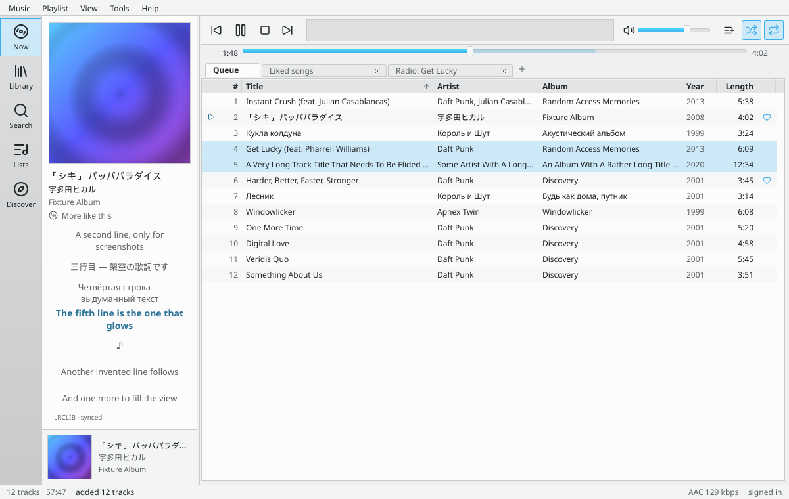 | 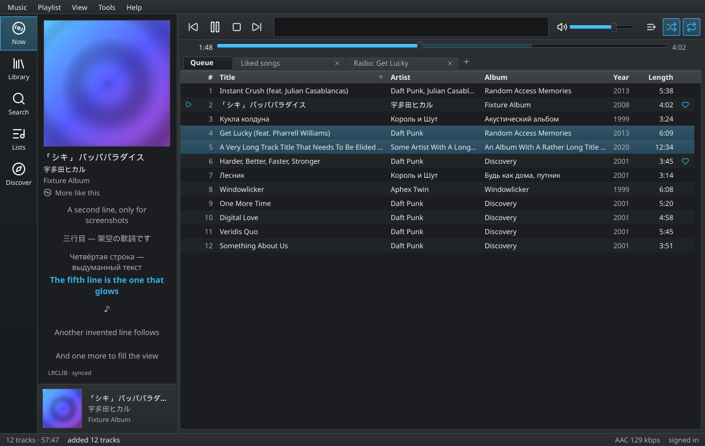 |
| 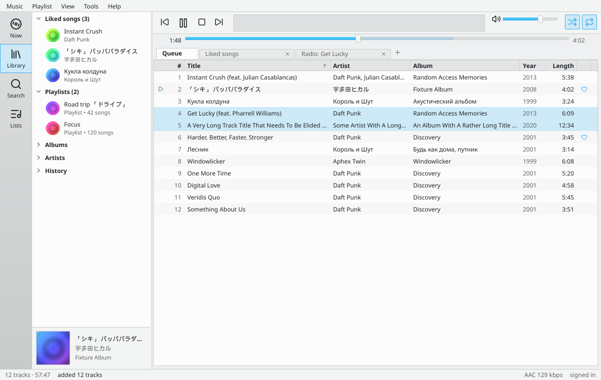 | 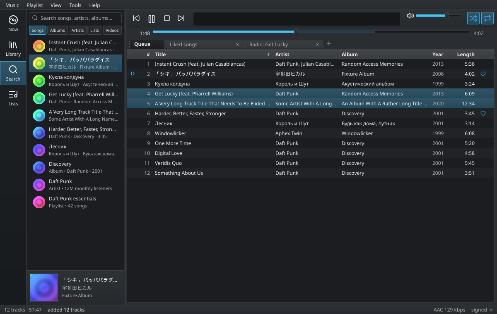 |
| 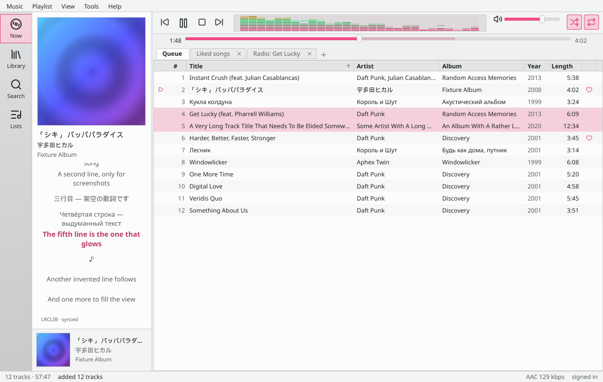 | 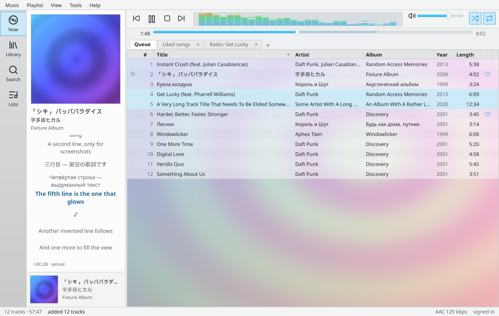 |
| 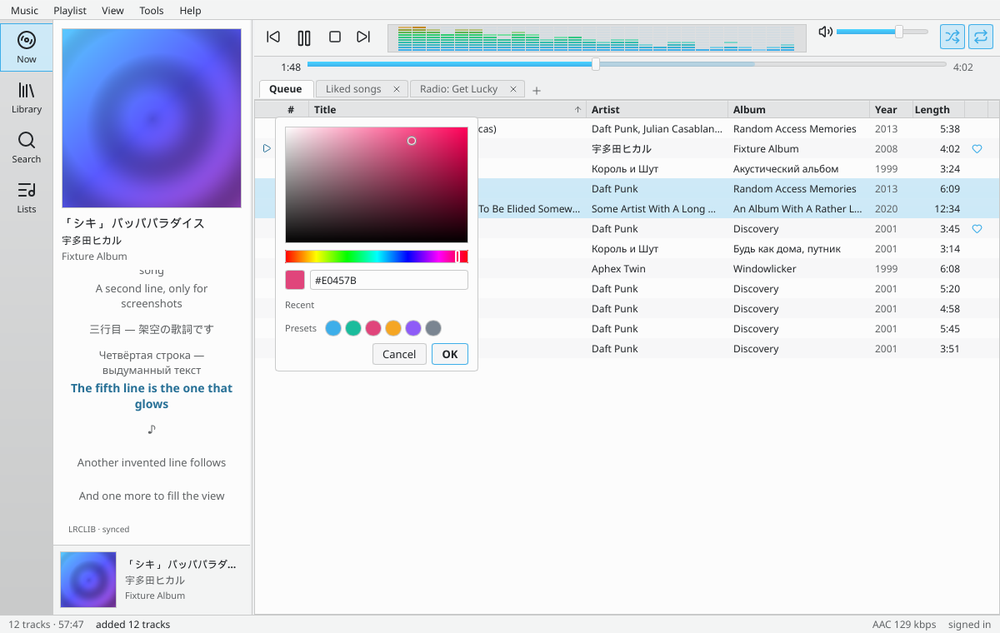 | 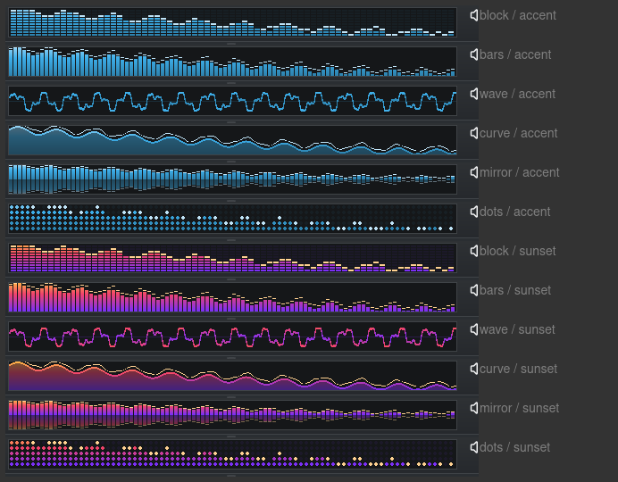 |
| 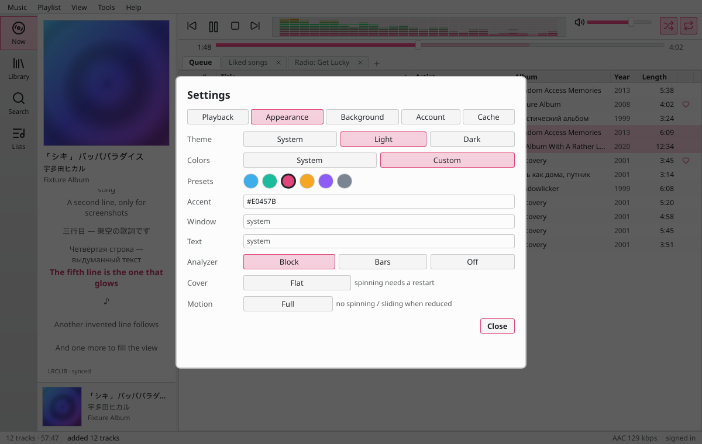 | 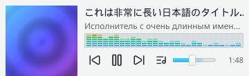 |
| 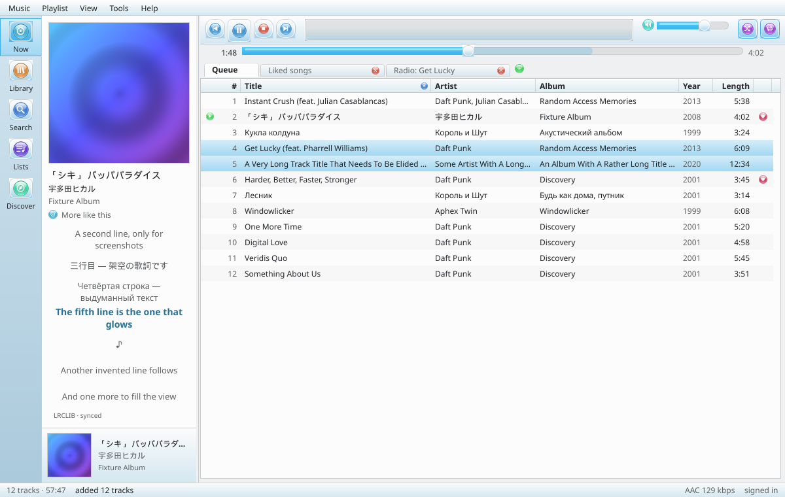 | 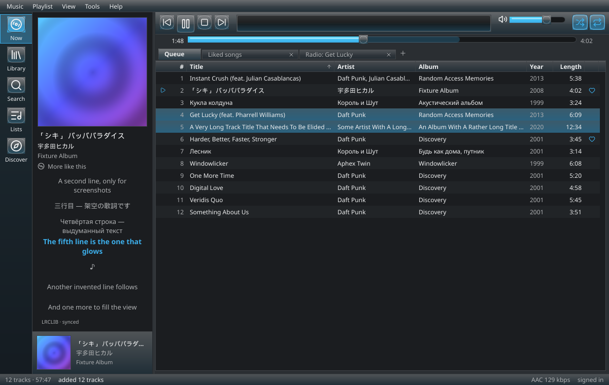 |
|  | 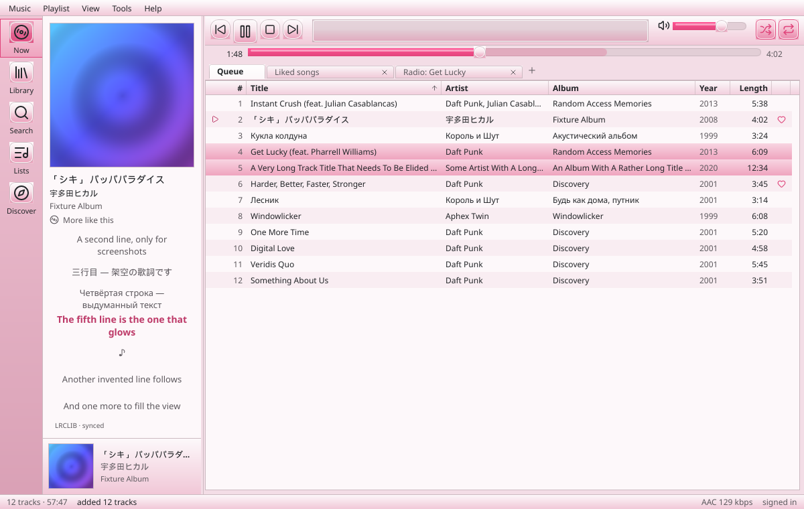 |

(Screenshots are rendered with fake data by `cloudberry --screenshot out.png --view main|search|library|lists|settings|appearance|background|mini --theme light|dark [--fixture rose|bg-cover|bg-image|...]`.)

## Features
- Native audio engine (symphonia + cpal): gapless playback, seeking, a real spectrum analyzer
  driven by the decoded samples: Block, Bars, Wave, Curve, Mirror bars or Dots, constant cell size
  at any window width, colour schemes (accent, classic, ice, sunset, mono, custom). libmpv remains
  available as an optional fallback engine (cargo feature `mpv`).
- Search songs, albums, artists, playlists and videos with thumbnails; drag results into the table.
- Your library as a lazy tree: liked songs, playlists, albums, artists, history; like/unlike
  (`Ctrl+L`).
- Discover: your home feed (quick picks, mixes, recommendations), new releases, charts by country
  and moods & genres, as shelves of cards; "More like this" starts a radio from the playing song.
- Playlist tabs (saved between runs), sortable and resizable columns, multi-select, drag to
  reorder, autoplay radio when the queue runs out.
- Synced lyrics (LRCLIB) in the Now panel; artist pages (top songs, albums, videos, related
  artists) and album pages as tabs. One track menu everywhere (tables, search, library, Discover,
  artist pages, the Now panel): Play, Play next, Add to queue, Add to playlist, radio, go to
  artist / album, like, copy link. The player bar has an "Add to playlist" button (`Ctrl+P`) for
  the playing song; additions show in the status bar with Undo.
- Skins (Classic, or glossy Aero glass), three icon sets (Line, Aero, Pixel) and a font of your
  choice (installed families or bundled Atkinson Hyperlegible, separate lyrics font, size), all
  switchable live in Settings with a preview. The same look on every system: every widget is
  drawn by the app, not the platform.
- Light / dark / system theme, custom accent, window and text colours with an in-app colour
  picker and presets, and an optional playlist background (pattern, album cover or your own
  picture; 3×3 anchor, blur, tint, opacity).
- Mini player (`Ctrl+M`), media keys / MPRIS, reduce-motion option, keyboard-first.
- Every feature also has a headless subcommand with `--json`: `search`, `play`, `auth`, `liked`,
  `playlist`, `radio`, `lyrics`, `discover`, `doctor`.

## Requirements
Nothing to install by hand. Cloudberry resolves streams with **yt-dlp** (which needs **deno** for
YouTube's JavaScript challenges) and decodes them itself. On first start it downloads the official
standalone yt-dlp and deno binaries (about 50 MB, checked against the published SHA-256 sums) into
its data folder and checks for a newer yt-dlp once a day. Settings → Playback shows the versions,
has "Update now" and can switch to the copies on your PATH instead (`cloudberry tools
install|update|status` does the same headless; builds made with `--features system-tools`, as
distro packages do, never download). `cloudberry doctor` reports what is found.

**mpv** is an optional fallback engine, only in builds made with `--features mpv` (needs libmpv at
run time; release packages do not include it). Building from source needs ALSA, fontconfig and
xkbcommon headers on Linux, plus the mpv development files when you enable the `mpv` feature.

## Build from source
```
cargo build --release     # binary in target/release/cloudberry (add --features mpv for the mpv engine)
cargo run --release       # GUI
scripts/package.sh tar|deb|rpm|appimage|flatpak|macos   # the release formats, into dist/
```
`cloudberry install-desktop` installs the launcher entry and icons for the current user
(`uninstall-desktop` removes them); packagers can use `packaging/io.github.nishiki001.Cloudberry.desktop`,
the AppStream file next to it and `assets/icons/app/png/`.

## Sign in
On first start a panel asks which browser you are signed in to. yt-dlp exports only the
YouTube/Google cookies to a private (mode 0600) file in the app data directory; Cloudberry never
reads browser profiles itself. You can also use it without an account (search, playback, radio,
lyrics work signed out). Headless: `cloudberry auth setup [--browser firefox]`, `auth check`,
`auth logout`.

Performance note: with the analyzer on, CPU use grows with the window size (about 9% playing at
1200×760 on the dev machine, 3% with the analyzer off). Settings → Appearance → Analyzer → Off
or a smaller window brings it down.

## Keyboard shortcuts
| Key | Action |
|---|---|
| `Space` | play / pause |
| `←` / `→` | seek 5 s |
| `Ctrl+←` / `Ctrl+→` | previous / next |
| `Ctrl+↑` / `Ctrl+↓` | volume |
| `Ctrl+F` | Search tab · `Esc` leaves the box |
| `Alt+1`–`Alt+5` | Now / Library / Search / Lists / Discover |
| `Ctrl+L` | like / unlike |
| `Ctrl+T` / `Ctrl+W` | new / close playlist tab |
| `Ctrl+A` | select all rows |
| `Ctrl+M` | mini player |
| `Ctrl+,` | settings |
| `Enter` | play selected row |
| `Delete`, `Alt+↑/↓` | remove / move the selected rows |
| right-click a row | play next, add to queue, radio, columns |

## Privacy
- Cookies are only sent to `*.youtube.com` / `*.google.com`; thumbnail requests carry none.
- Lyrics lookups send title, artist, album and duration to [lrclib.net](https://lrclib.net).
  Turn it off with `lyrics_lrclib = false` in `config.toml` (YouTube Music lyrics are still tried).
- Config, cache and logs live in the platform config/cache/data directories (`cloudberry`).

## Troubleshooting
- **"playback failed — try `yt-dlp -U`"**: YouTube changes often; update yt-dlp.
- **No sound / silent errors**: run `cloudberry play <videoId>` and look at the log in the data dir.
- **Library empty**: `cloudberry auth check`; run `auth setup` again after signing in to YouTube Music in the browser.
- **Short gap between tracks**: the native engine prefetches the next track; the mpv fallback
  engine cannot always do that for streams resolved through yt-dlp.
- **Window not found by the desktop**: run `cloudberry install-desktop` (app id `cloudberry`).

## Credits and licenses
- Code: GPL-3.0-or-later (see `LICENSE`). Uses [Slint](https://slint.dev) under the GPLv3 option.
- Icons: the Line set is [Lucide](https://lucide.dev), ISC license (`assets/icons/LICENSE-lucide.txt`);
  the Aero and Pixel sets are original (generated by `assets/icons/gen_icons.py`).
- Font: [Atkinson Hyperlegible](https://github.com/googlefonts/atkinson-hyperlegible), SIL OFL 1.1
  (`assets/fonts/OFL-AtkinsonHyperlegible.txt`).
- Audio: [symphonia](https://github.com/pdeljanov/Symphonia), [cpal](https://github.com/RustAudio/cpal),
  [rubato](https://github.com/HEnquist/rubato), [realfft](https://github.com/HEnquist/realfft);
  optional fallback engine [mpv](https://mpv.io). Streams resolved by
  [yt-dlp](https://github.com/yt-dlp/yt-dlp).
- InnerTube request shapes follow [ytmusicapi](https://github.com/sigma67/ytmusicapi) (MIT).
- Synced lyrics from [LRCLIB](https://lrclib.net).
- The app icon (`assets/icons/app/`, a cloudberry) and all other artwork (disc, background pattern) is original and generated in this repo.

"YouTube" and "YouTube Music" are trademarks of Google LLC. This project is not affiliated
with or endorsed by Google.

## How this was made
Cloudberry was entirely vibecoded with Claude Code, using Claude Opus 5.5 and Claude Sonnet 5.5. `CLAUDE.md` contains the instructions it was built with. The app icon was made with Google Gemini.
